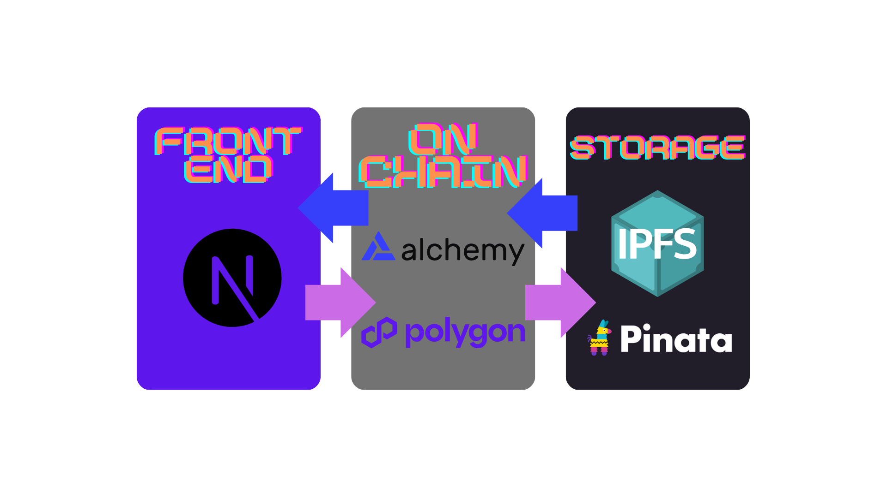

## CVeri —— Resume Verification System

CVeri is a decentralized application (DApp) built to combat the widespread issue of resume fraud in today’s job market. By leveraging blockchain technology, CVeri offers a transparent, secure, and efficient way to verify the authenticity of professional experiences. Users can submit their resume data, which is stored on IPFS and referenced on the Polygon Mainnet. Authorized certifiers can validate these experiences, and recruiters can verify claims using immutable blockchain references.


#### know more about CVeri by this video below:

[](https://www.youtube.com/watch?v=igbxAO8-L0k)


### Introduction
CVeri was born from the real-world frustration of honest job seekers — including our team — who faced delays due to the inefficiencies of traditional resume verification processes. At the same time, recruiters struggle to verify credentials quickly and accurately amidst high volumes of applications.

Our goal was to streamline this process by building a decentralized verification system where users own their data, certifications are public and tamper-proof, and recruiters can verify claims in seconds. With CVeri, users generate cryptographic experience hashes that can be verified and certified on-chain, solving the pain points of both sides of the hiring table.

---
## Background

### The Problem

When screening job applications, HR professionals develop various methods for evaluation, but verification of objective qualifications remains essential. If a candidate claims to have graduated from a prestigious university or to hold multiple patents, how can recruiters efficiently verify this information?

In a typical scenario, HR might have less than a minute per resume during initial screening. Manually verifying each credential across multiple databases is impractical given time constraints. This creates a dilemma:

- Trust claims without verification, risking hiring based on fraudulent information
- Invest significant time in verification, reducing overall recruitment efficiency
- Defer verification until interview stages, potentially wasting time on unqualified candidates

Our system addresses this verification bottleneck by providing pre-validated credentials that can be instantly verified through blockchain technology.

### Market Need

Industry leaders acknowledge the importance of resume verification. As noted by Kai-Fu Lee, reputable companies will verify resume contents, particularly for senior positions. However, the verification process remains inefficient and time-consuming.

Recent studies reveal concerning statistics about resume fraud:

- Only 34% of job seekers report having completely truthful resumes
- Over 10% admit to outright falsification on their resumes
- Nearly 50% acknowledge exaggerating their experiences
- Approximately 60% of respondents consider resume "enhancement" acceptable
- Only 28.3% express disapproval of resume fraud

These statistics demonstrate that resume falsification is a widespread problem in the job market. More troublingly, research indicates that awareness of others' resume fraud correlates with increased likelihood of personal misrepresentation, potentially creating a vicious cycle in recruitment ecosystems.

### Blockchain Technology as a Solution

Blockchain technology provides an ideal solution for credential verification through its core attributes:

- **Immutability**: Once recorded, credentials cannot be altered
- **Decentralization**: No single entity controls the verification system
- **Transparency**: All parties can verify the authenticity of credentials
- **Privacy Control**: Candidates maintain ownership of their verified information
- **Selective Disclosure**: Candidates can choose which verified credentials to share

Since the introduction of Bitcoin in 2009 by Satoshi Nakamoto (marking Blockchain 1.0), and the subsequent emergence of Ethereum with smart contracts (Blockchain 2.0), blockchain technology has evolved rapidly. Enterprise solutions like IBM's Hyperledger further demonstrate blockchain's potential for business applications.

Our Resume Verification System builds upon these technological advancements to create a trusted ecosystem for credential verification, benefiting all stakeholders in the recruitment process.

---
## Implementation



Our system implementation follows a modern web3 architecture pattern with the following components:

### Frontend
Built with **Next.js** and styled using **Tailwind CSS**, the UI offers a responsive experience. Real-time feedback, role-based access, and animations improve usability.

### Blockchain Infrastructure
The smart contract is deployed on the **Polygon Mainnet** using **Alchemy**. It manages resume hashes, role permissions, and certification logic, all written in **Solidity**.

### Data Storage
Resume data is stored using Pinata's IPFS (InterPlanetary File System) integration, providing truly decentralized and immutable storage. This approach ensures:
- Content addressing rather than location addressing
- Resistance to censorship
- Reduced dependency on central servers
- Permanent availability of records

### Wallet Integration
CVeri uses **MetaMask** for Ethereum wallet access. Network checks and automatic prompts ensure users are connected to Polygon before proceeding.


The combination of these technologies creates a robust, scalable system that maintains data integrity while providing a seamless user experience for all participants.

---
## Features

- **Submit Resumes**: Users create on-chain resume hashes linked to IPFS data
- **Blockchain Storage**: All data is securely stored on the Polygon blockchain with content on IPFS
- **Certify Experiences**: Certifiers approve valid claims using experience hashes
- **Verify Credentials**: Anyone can verify hash legitimacy and certifications
- **Admin Panel**: Admins manage certifiers and new admins via a secured panel
- **Wallet Integration**: Seamless wallet connection for blockchain transactions

---
## System Architecture

The application consists of:

- **Smart Contract**: Solidity contract on Polygon Mainnet
- **Frontend**: React (Next.js) web app with dynamic routing and role-aware UI
- **IPFS Integration**: Decentralized content storage using Pinata
- **Pages**:
   - Submit Resume (`/SubmitCV`)
   - Certify Experience (`/CertifyCV`)
   - Verify Experience (`/verifyCV`)
   - Admin Panel (`/AdminMode`)

---
## Prerequisites

- MetaMask browser extension
- Access to Polygon Mainnet

---
## Installation

You can get started with CVeri in two ways: **locally** or by accessing the **deployed app on Vercel**.

---

### 🔗 Option 1: Use the Deployed Version on Vercel (Recommended)

No setup required — just visit our live site:

👉 [https://cveri.vercel.app/](https://cveri.vercel.app/)

- Connect your MetaMask wallet
- Switch to Polygon Mainnet if prompted
- Begin submitting, certifying, or verifying resumes

---

### 💻 Option 2: Run Locally
1. Clone the repository:
   ```bash
   git clone https://github.com/yourusername/resume-verification-system.git
   cd resume-verification-system
   ```

2. Install dependencies:
   ```bash
   npm install
   ```

3. Create a `.env.local` file in the root directory with the following variables:
   ```
   NEXT_PUBLIC_PINATA_API_KEY=your_pinata_api_key
   NEXT_PUBLIC_PINATA_API_SECRET=your_pinata_api_secret
   NEXT_PUBLIC_CONTRACT_ADDRESS=0x9241f04634ff89799b0dd96916adb0ca1351a910
   ```

4. Start the development server:
   ```bash
   npm run dev
   ```

5. Open [http://localhost:3000](http://localhost:3000) with your browser to see the result.

---
## Usage

### For Users

1. Navigate to the Submit Resume page
2. Connect your MetaMask wallet
3. Fill in your name and experience details
4. Submit your information to get a verification hash
5. Share this hash with potential employers for verification

### For Certifiers

1. Navigate to the Certify Experience page
2. Connect your MetaMask wallet (must be an authorized certifier)
3. Enter the experience hash you want to certify
4. Confirm the transaction to add your certification

### For Verifiers

1. Navigate to the Verify Experience page
2. Connect your MetaMask wallet
3. Enter the experience hash to verify
4. View the experience details and its certifications

### For Admins

1. Navigate to the Admin page
2. Connect your MetaMask wallet (must be an admin)
3. Add new certifiers by entering their wallet address and title/organization
4. Add new admins by entering their wallet address


---
## Smart Contract

The **ResumeRegistry** contract on Polygon Mainnet manages:
- Resume CID storage
- Hash-based experience verification
- Role-based access control (admins/certifiers)

---
## Deployment

### Local Development

```bash
npm run dev
```

### Production Deployment

The CVeri app is already deployed and accessible at:

👉 https://cveri.vercel.app

If you'd like to deploy your own version using Vercel:

1. Fork or push your code to a GitHub repository
2. Visit https://vercel.com and import your repository
3. Configure the following environment variables in the Vercel dashboard:
- NEXT_PUBLIC_PINATA_API_KEY
- NEXT_PUBLIC_PINATA_API_SECRET
- NEXT_PUBLIC_CONTRACT_ADDRESS
4. Click Deploy, and Vercel will build and host your application

You may also choose to deploy using Netlify, AWS Amplify, or traditional hosting services if preferred.

Alternative deployment options include Netlify, AWS Amplify, or traditional hosting services.

### Important: Environment Variables

Before deploying to production:

1. **Move Pinata keys to environment variables** - The current implementation has hardcoded API keys in the `pinataService.js` file. These should be moved to environment variables for security.
2. Ensure your contract address is correctly set in the environment variables

---
## Technology Stack

- **Frontend**: Next.js, React, TailwindCSS
- **Blockchain Interaction**: ethers.js, Alchemy
- **Wallet Connection**: MetaMask
- **Storage**: IPFS via Pinata
- **Blockchain**: Polygon Amoy testnet

---
## Security Notes

- This application uses MetaMask for transaction signing
- All blockchain transactions require user confirmation
- Experience data is stored on IPFS with references on the blockchain
- Admin functions are protected by onlyAdmin modifiers in the smart contract
- Certifier functions are restricted to authorized certifiers

---
## Code Formatting

This project uses [Prettier](https://prettier.io) to ensure consistent code formatting. The configuration for Prettier is defined in the `.prettierrc` file.

A helper script named `format-files.js` is provided to format source files. It targets JavaScript, TypeScript, JSX, TSX, and JSON files under the `src` directory.

### How to Format Files

You can format your files in one of the following ways:

```bash
npx run format
# or
npx prettier --write .
```

---
## References

[1] S. Nakamoto, "Bitcoin: A Peer-to-Peer Electronic Cash System," 2009. [Online]. Available: https://bitcoin.org/bitcoin.pdf

[2] V. Buterin et al., "Ethereum: A Next-Generation Smart Contract and Decentralized Application Platform," 2014. [Online]. Available: https://ethereum.org/en/whitepaper/

[3] "Resume Authenticity Survey Results," BBS for Fresh Graduates (应届生论坛), 2020. [Online survey].

[4] L. Wang and J. Zhang, "The Relationship Between Awareness of Resume Fraud and Personal Misrepresentation Behavior," Journal of Employment Ethics, vol. 16, no. 3, pp. 122-138, 2021.

[5] S. Chen, X. Li, and Y. Wang, "Attitudes Toward Resume Fraud Among Job Seekers," International Journal of Human Resource Management, vol. 28, no. 4, pp. 673-691, 2019.

[6] IBM, "Hyperledger Fabric Documentation," IBM Blockchain Platform. [Online]. Available: https://www.ibm.com/blockchain/hyperledger

[7] K. Lee, "The Future of Recruitment: Authentic Credentials and AI," AI Superpowers Conference, Beijing, 2018.

[8] Polygon Technology, "Polygon Amoy Documentation," Polygon Network. [Online]. Available: https://polygon.technology/solutions/polygon-pos

---
## License

This project is licensed under the MIT License - see the LICENSE file for details.

---
## Acknowledgments

- [Next.js](https://nextjs.org/)
- [ethers.js](https://docs.ethers.io)
- [IPFS](https://ipfs.io/)
- [Pinata](https://pinata.cloud/)
- [Polygon](https://polygon.technology/)
